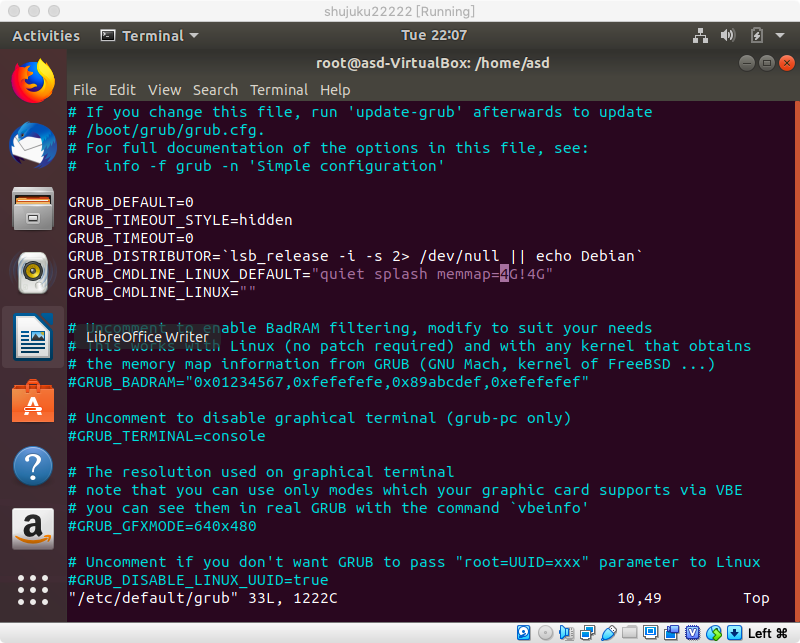
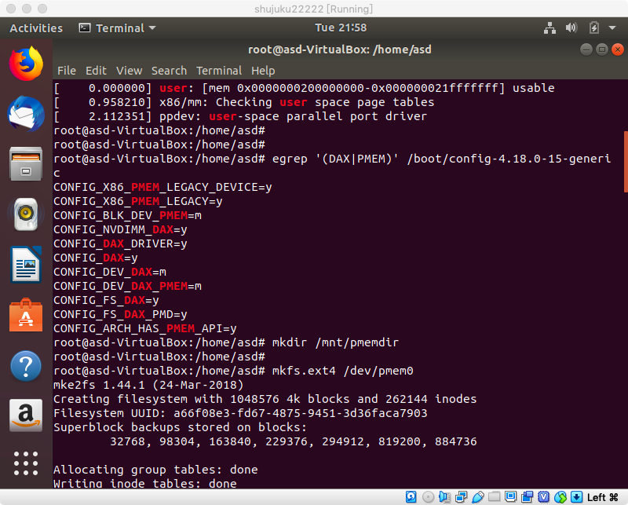
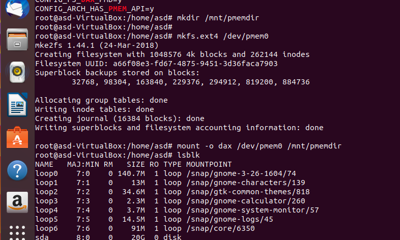
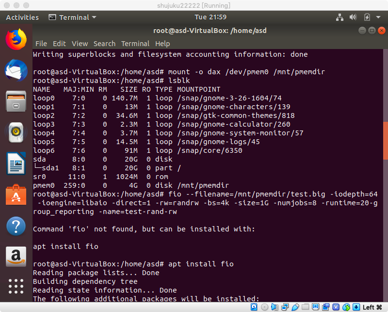
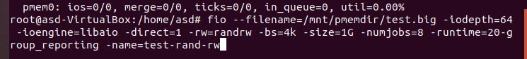
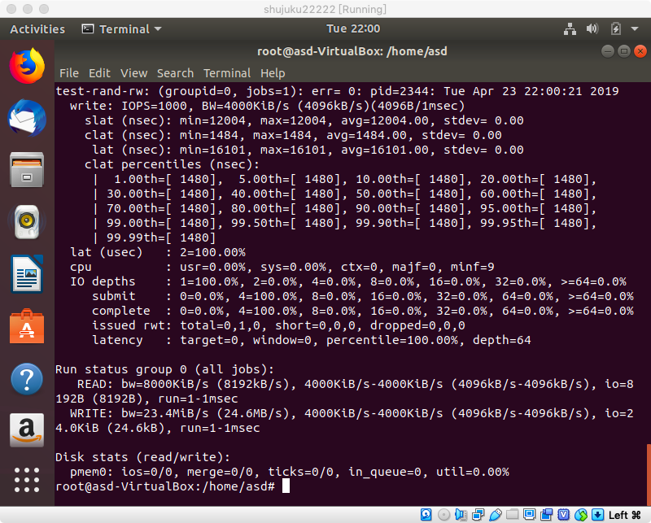
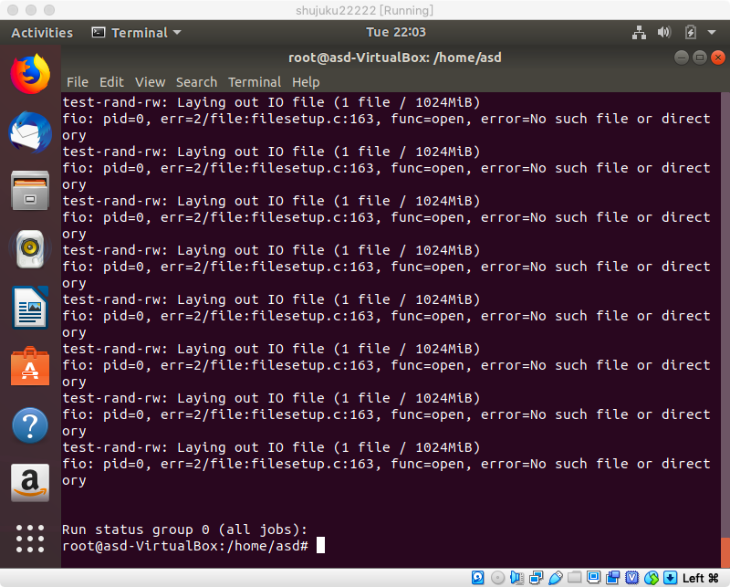

### 参考[Intel的NVM模拟教程](https://software.intel.com/zh-cn/articles/how-to-emulate-persistent-memory-on-an-intel-architecture-server)模拟NVM环境，用fio等工具测试模拟NVM的性能并与磁盘对比（关键步骤结果截图）。
（推荐Ubuntu 18.04LTS下配置，跳过内核配置，编译和安装步骤）
配置
虚拟机内存:8G
虚拟机镜像：Ubuntu 18.04
运行
````sh
su passwd
123
123

su
123

apt install vim -y
vim /etc/default/grub
````
增加一行
````sh
GRUB_CMDLINE_LINUX_DEFAULT="quiet splash memmap=4G!4G"
````
修改后如图



配置grub
教程上的用不了，要把grub2全变成grub才行
```sh
grub-mkconfig -o /boot/grub/grub.cfg
````


重启
```sh
reboot
```
查看内核中是否内置了 DAX 和 PMEM
```sh
egrep '(DAX|PMEM)' /boot/config-（按下tab自动补全）
```


安装包含DAX的文件系统，制作文件系统，映射
````sh
mkdir /mnt/pmemdir
mkfs.ext4 /dev/pmem0
mount -o dax /dev/pmem0 /mnt/pmemdir
lsblk
````



安装fio
```sh
apt install fio
```

在NVM上用fio测试性能




在磁盘上用fio测试性能




可以看到NVM比磁盘快很多


