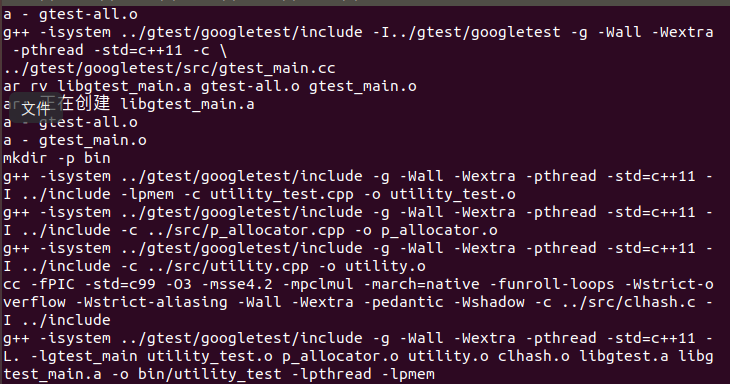
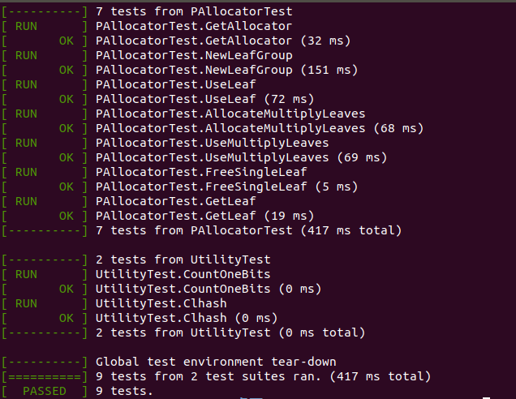

# 2019.5.5
- 初始化仓库
- 初步完成系统说明书
- 实现lycsb.cpp

# 2019.5.17
- 初始化README.md
- 完成测试代码makefile的编写
  根据[gtest仓库的示例makefile](https://github.com/google/googletest/blob/master/googletest/make/Makefile)完成了测试代码的makefile

# 2019.5.30
- 完成p_allocator.cpp的实现和运行，utility_test.cpp的运行
- 更改makefile的编写以及测试。
- 测试：
  + 命令：
     - cd test
     - make
     - cd bin
     - mkdir data
     - ./utility_test
  + 测试结果截图：
     - 
     - 

- 理解：这是使用树结构来存储数据，每个叶子节点就是一个叶组，每个叶组里有16个相对内存地址以及对应的id，相对内存地址加上叶组所在的地址就是指向数据所在的地址。

---
 
参考资料   

[NVM编程文档](https://docs.pmem.io/getting-started-guide/introduction)   
